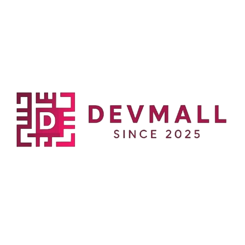

<h1 align="center">
  
  <br>
  DevMall
</h1>

<p align="center">
  <b>Explore tech job opportunities across top global companies</b><br>
  Seamless. Simple. Smart.
</p>

<p align="center">
  
  
</p>

---

## 🚀 Features

- 🔍 **Search bar** to find companies quickly  
- 🗂 **Filter options** by Experience, Location, and Work Mode  
- 🌐 **Live links** to official career portals  
- 🖼 **Logos** displayed alongside company names  
- ⚡ **Fast** and **responsive** design  
- 🛠 Built with pure **HTML**, **CSS**, **JavaScript**, and **Node.js**  
- ❌ No database required — runs entirely on local/server data  

---

## 🖥️ Tech Stack

| Frontend      | Backend  | Assets             |
|---------------|----------|--------------------|
| HTML, CSS     | Node.js  | Local Logo Images  |
| JavaScript    | Express  | Stored in `/images`|

---

## 🚦 Getting Started

Follow these steps to run **DevMall** on your local machine:

```bash
# 1️⃣ Clone the repository
git clone https://github.com/Sayaniiii08/devmall.git
cd devmall

# 2️⃣ Install dependencies
npm install

# 3️⃣ Start the local server
node server.js

# 4️⃣ Open the app in your browser
http://localhost:3000
```

📸 Preview
<p align="center">  </p>

🧠 Future Scope

✅ Add real-time job API integrations

📝 Launch DevMall Blog section for tech news

🔔 Email/job alerts system

🌍 Deploy to Vercel or Render (free tiers)


🧑‍💻 Author

👩‍💻 Sayani Mondal
💬 “Building one tech brick at a time.”


You can also deploy this project to GitHub Pages, Vercel, or Netlify.

⚖️ License

This project is licensed for educational and portfolio purposes.

Contact for commercial or collaborative use.

<p align="center"> 💡 “Tech careers made accessible — that’s the DevMall vision.” 💡 </p> 
